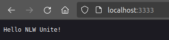

# pass.in

O pass.in é uma aplicação de **gestão de participantes em eventos presenciais**. 

A ferramenta permite que o organizador cadastre um evento e abra uma página pública de inscrição.

Os participantes inscritos podem emitir uma credencial para check-in no dia do evento.

O sistema fará um scan da credencial do participante para permitir a entrada no evento.

## Requisitos

### Requisitos funcionais

- [x] O organizador deve poder cadastrar um novo evento;
- [x] O organizador deve poder visualizar dados de um evento;
- [x] O organizador deve poser visualizar a lista de participantes; 
- [x] O participante deve poder se inscrever em um evento;
- [x] O participante deve poder visualizar seu crachá de inscrição;
- [x] O participante deve poder realizar check-in no evento;

### Regras de negócio

- [x] O participante só pode se inscrever em um evento uma única vez;
- [x] O participante só pode se inscrever em eventos com vagas disponíveis;
- [x] O participante só pode realizar check-in em um evento uma única vez;

### Requisitos não-funcionais

- [x] O check-in no evento será realizado através de um QRCode;

## Documentação da API (Swagger)

Para documentação da API, acesse o link: https://nlw-unite-nodejs.onrender.com/docs

## Banco de dados

Nessa aplicação vamos utilizar banco de dados relacional (SQL). Para ambiente de desenvolvimento seguiremos com o SQLite pela facilidade do ambiente.

### Diagrama ERD


### Estrutura do banco (SQL)

```sql
-- CreateTable
CREATE TABLE "events" (
    "id" TEXT NOT NULL PRIMARY KEY,
    "title" TEXT NOT NULL,
    "details" TEXT,
    "slug" TEXT NOT NULL,
    "maximum_attendees" INTEGER
);

-- CreateTable
CREATE TABLE "attendees" (
    "id" INTEGER NOT NULL PRIMARY KEY AUTOINCREMENT,
    "name" TEXT NOT NULL,
    "email" TEXT NOT NULL,
    "event_id" TEXT NOT NULL,
    "created_at" DATETIME NOT NULL DEFAULT CURRENT_TIMESTAMP,
    CONSTRAINT "attendees_event_id_fkey" FOREIGN KEY ("event_id") REFERENCES "events" ("id") ON DELETE RESTRICT ON UPDATE CASCADE
);

-- CreateTable
CREATE TABLE "check_ins" (
    "id" INTEGER NOT NULL PRIMARY KEY AUTOINCREMENT,
    "created_at" DATETIME NOT NULL DEFAULT CURRENT_TIMESTAMP,
    "attendeeId" INTEGER NOT NULL,
    CONSTRAINT "check_ins_attendeeId_fkey" FOREIGN KEY ("attendeeId") REFERENCES "attendees" ("id") ON DELETE RESTRICT ON UPDATE CASCADE
);

-- CreateIndex
CREATE UNIQUE INDEX "events_slug_key" ON "events"("slug");

-- CreateIndex
CREATE UNIQUE INDEX "attendees_event_id_email_key" ON "attendees"("event_id", "email");

-- CreateIndex
CREATE UNIQUE INDEX "check_ins_attendeeId_key" ON "check_ins"("attendeeId");
```

# Detalhes do Projeto da Trilha NodeJS [@Rocketseat](https://www.rocketseat.com.br)

* Já tenho o NodeJS instalado, mas se você precisar instalar vá até a página oficial do [NodeJS](https://nodejs.org/en/learn/getting-started/how-to-install-nodejs).

* Criar um projeto NodeJS

```bash
npm init -y
```
* NodeJS, por padrão, entende apenas [Javascript](https://ecma-international.org/publications-and-standards/standards/ecma-262/), que tem tipagem dinâmica. Vamos instalar suporte para [Typescript](https://www.typescriptlang.org/), que tem tipagem estática.

```bash
npm i typescript @types/node -D
```

| Shorthands | Syntax     | Description                                                                                                        |
| ---------- | ---------- | ------------------------------------------------------------------------------------------------------------------ |
| i          | install    | it will install everything the project needs, in the node_modules folder, creating it if it's not existing already |
| -D         | --save-dev | installs and adds the entry to the package.json file devDependencies                                               |

* Vamos inicializar o projeto Typescript, conforme o comando abaixo, que vai criar o arquivo `tsconfig.json`

```bash
npx tsx --init
```

> npx -> execute npm package binaries

> --init -> Initializes a TypeScript project and creates a tsconfig.json file.

Vamos acessar o [Github](https://github.com/tsconfig/bases) do `tsconfig`, acessar a versão do NodeJS que estamos usando e substituir as configurações do arquivo padrão por este último.

```json
{
  "$schema": "https://json.schemastore.org/tsconfig",
  "_version": "20.1.0",

  "compilerOptions": {
    "lib": ["es2023"],
    "module": "node16",
    "target": "es2022",

    "strict": true,
    "esModuleInterop": true,
    "skipLibCheck": true,
    "moduleResolution": "node16"
  }
}
```

  * Vamos informar ao `tsconfig`, onde estão os arquivos Typescript (.ts) para serem convertidos em arquivos Javascript (.js).

```json
{
  "$schema": "https://json.schemastore.org/tsconfig",
  "_version": "20.1.0",

  "compilerOptions": {
    "lib": ["es2023"],
    "module": "node16",
    "target": "es2022",

    "strict": true,
    "esModuleInterop": true,
    "skipLibCheck": true,
    "moduleResolution": "node16"
  }
  "include": ["src"]
}
```

  * Instalar o `tsx` (tsx is a CLI command (alternative to node) for seamlessly running TypeScript & ESM, in both commonjs & module package types.)

```bash
npm i tsx -D
```

  * Podemos automatizar a execução do nosso `server.ts` alterando o arquivo `package.json`, altrerando na sessão _scripts_ conforme abaixo.

  ```json
  {
  "name": "server",
  "version": "1.0.0",
  "description": "O pass.in é uma aplicação de **gestão de participantes em eventos presenciais**.",
  "main": "index.js",
  "scripts": {
    "dev": "tsx watch src/server.ts"
  },
  "keywords": [],
  "author": "",
  "license": "ISC",
  "devDependencies": {
    "@types/node": "^20.12.5",
    "tsx": "^4.7.2",
    "typescript": "^5.4.4"
  }
}
```
  * Para executar nosso servidor

```bash
npm run dev
```
onde temos a saída abaixo, onde qualquer alteração no `server.ts` vai ser automaticamente atualizado!

```bash
> server@1.0.0 dev
> tsx watch src/server.ts

Hello World
```

  * Vamos deixar nosso desenvolvimento bem mais interessante, instalando um micro-framework, o `fastify`

```bash
npm i fastify
```

_server.ts_
```typescript
import { fastify } from 'fastify';

const app = fastify()

app.get('/',() => {
    return 'Hello NLW Unite!'
})

app.listen({ port: 3333 }).then(() => {
    console.log('HTTP server running!')
})
```

Estamos informando que a aplicação vai "escutar" na porta 3333 e apresentar a mensagem "Hello NLW Unite!", para validar isso apenas abra o seu navegador e digite: `localhost:3333`



* Configurando um banco de dados, neste projeto usaremos o [ORM Prisma](https://www.prisma.io)

```bash
npm i prisma -D
```

Vamos utilizar o banco de dados relacional [SQLite](https://www.sqlite.org), simplificando nossa vida de desenvolvedor web :wink:

```bash
npx prisma init --datasource-provider SQLite
```
Ajustando o arquivo `package.json` para o Node leia o arquivo de variáveis de ambiente (`.env`).

```json
"scripts": {
    "dev": "tsx watch --env-file .env src/server.ts"
  },
```

* Extensões do VSCode que vamos usar:

[Prisma](https://marketplace.visualstudio.com/items?itemName=Prisma.prisma) 

[REST Client](https://marketplace.visualstudio.com/items?itemName=humao.rest-client)

[DotENV](https://marketplace.visualstudio.com/items?itemName=mikestead.dotenv)

> É importante que essa linha estejam no seu arquivo `settings.json`

_settings.json_
```json
    "[prisma]": {
        "editor.defaultFormatter": "Prisma.prisma",
        "editor.formatOnSave": true
      },
```

* Vamos criar as tabelas do nosso banco de dados, acessando o arquivo `./prisma/schema_prisma`

```json
// This is your Prisma schema file,
// learn more about it in the docs: https://pris.ly/d/prisma-schema

generator client {
  provider = "prisma-client-js"
}

datasource db {
  provider = "sqlite"
  url      = env("DATABASE_URL")
}

model Event {
  id               String  @id @default(uuid())
  title            String
  details          String?
  slug             String  @unique
  maximumAttendees Int?    @map("maximum_attendees")

  @@map("events")
}
```

> gravando a tabela no banco de dados, através do comando _migrate_

```bash
npx prisma migrate dev
```

```bash
Environment variables loaded from .env
Prisma schema loaded from prisma/schema.prisma
Datasource "db": SQLite database "dev.db" at "file:./dev.db"

SQLite database dev.db created at file:./dev.db

? Enter a name for the new migration: › 
```

Agora identificamos nossa _migrate_, como um _commit_ 

`create table events`

E para visualizar esta tabela podemos usar o próprio **Prisma**

```bash
npx prisma studio
```

* Criando nossa primeira *rota* em `server.ts`

```typescript
app.post('/events',(request, reply) => {
    console.log(request.body)
})
```

* para testar esta rota utilizamos o *REST Client* criando um arquivo `api.http`.

```json
POST http://localhost:3333/events
Content-Type: application/json

{
    "title": "Unite Summit",
    "details": "Um evento para que é apaixonado por programação",
    "maximumAttendees": 100
}
```

* Validação de dados com o [zod](https://www.npmjs.com/package/zod)

```bash
npm i zod
```


